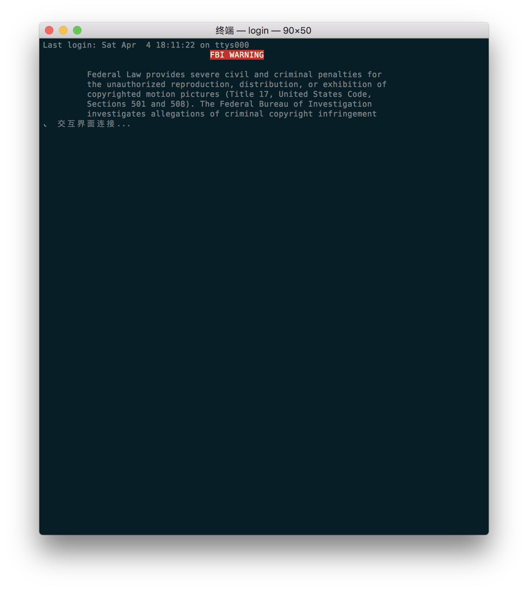
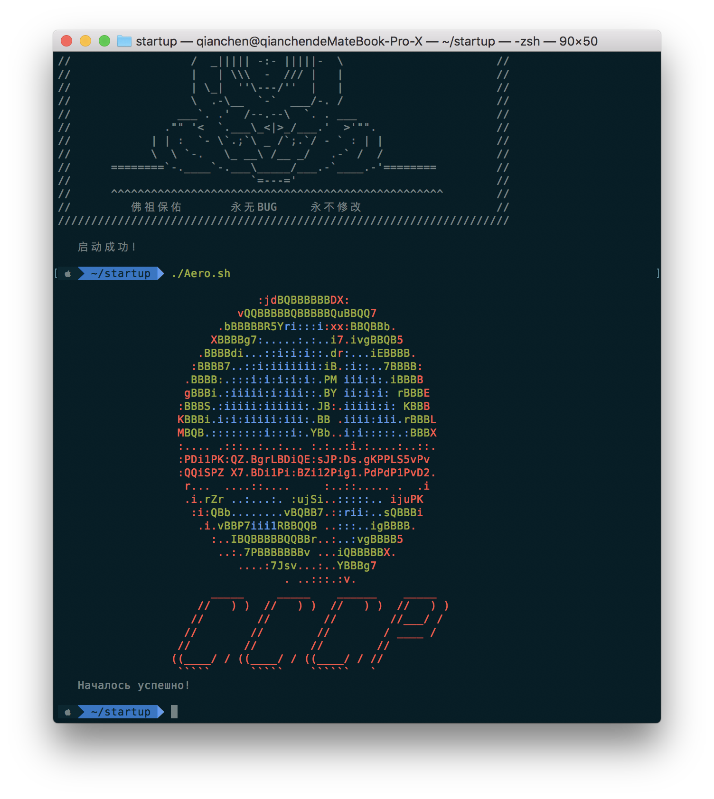
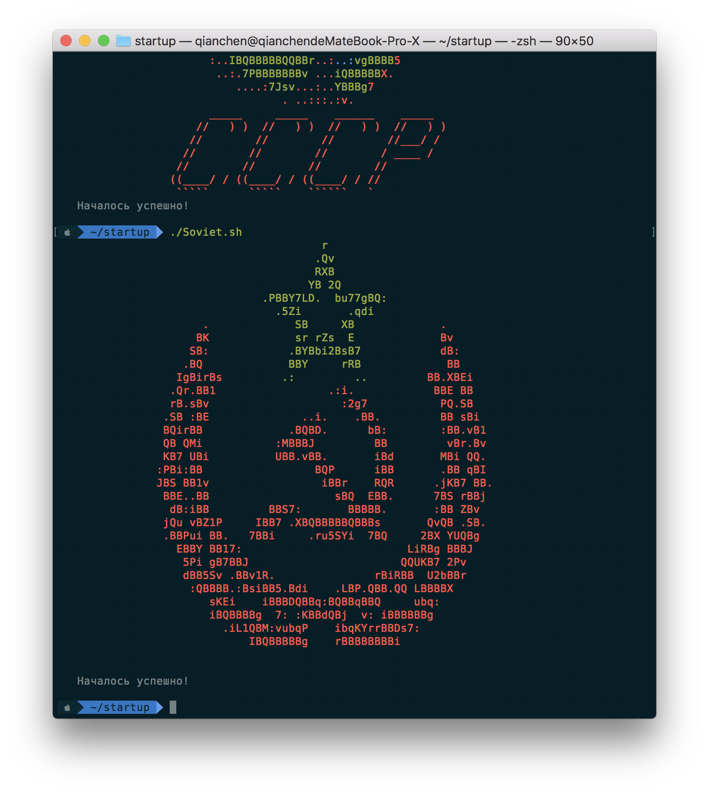
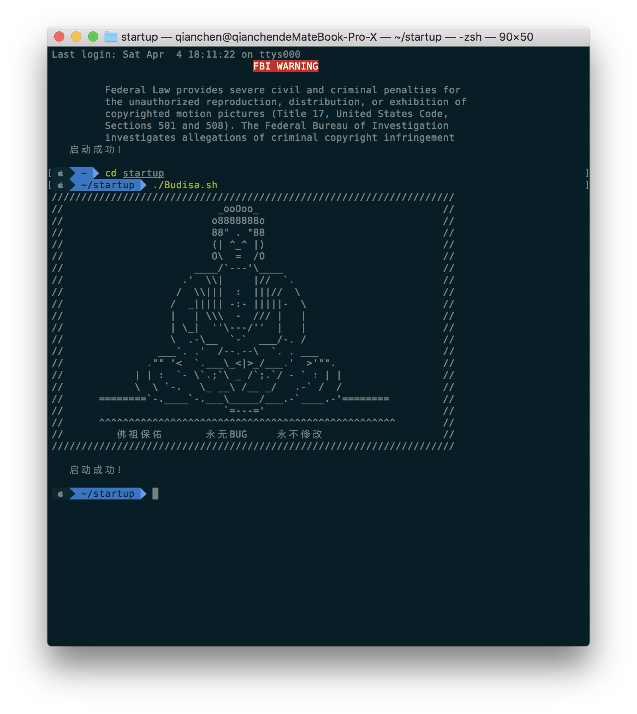

# Usage

1. Copy the file a directory

2. ```Vim ~/.zprofile```

3. Add ```your_directory/***.sh``` (*** means different sh files) to zprofile.

# Notes

1. You need to install zsh

2. You need to install loading-cli to execute loading animation.

3. This is inspired by [echohn](http://echohn.github.io/2016/10/01/about-improve-zsh-response-speed/)'s passage.

FBI Warning

<div div align=center></div>

Aero

<div div align=center></div>

Soviet

<div div align=center></div>

Budisa

<div div align=center></div>